# Budget Voice API

API REST que aceita comandos de voz em português para gerenciar finanças pessoais. Usa Spring AI com Tool Calling para entender a intenção do usuário e executar operações reais no banco de dados. Stack 100% gratuita: Groq (LLM + transcrição) e gTTS (síntese de voz via Google TTS em Docker).

## Visão Geral

```mermaid
graph LR
    U[Usuário] -->|áudio| API[Budget Voice API<br/>Spring Boot :8080]
    API -->|transcrição| W[Groq Whisper]
    API -->|Tool Calling| L[Groq Llama 4 Scout]
    API -->|persistência| PG[(PostgreSQL)]
    API -->|síntese| GTTS[gTTS Flask :5002]

    style U fill:#1a1a2e,stroke:#bc8cff
    style API fill:#1a1a2e,stroke:#58a6ff
    style W fill:#1a2d1a,stroke:#3fb950
    style L fill:#1a2d1a,stroke:#3fb950
    style PG fill:#2d4a22,stroke:#3fb950
    style GTTS fill:#291a1a,stroke:#e94560
```



## Pré-requisitos

- Docker 24+
- Docker Compose v2+
- Conta gratuita no [Groq Console](https://console.groq.com) (sem cartão de crédito)

## Como Executar

```bash
git clone <url>
cd budget-voice-api
cp .env.example .env
# Editar .env e inserir GROQ_API_KEY=gsk_sua_chave
docker compose up --build
```

A API estará disponível em `http://localhost:8080`. O serviço gTTS (Flask) sobe em segundos. O endpoint `/api/voice/command/audio` requer internet para sintetizar voz via Google TTS.

## Como Testar

```bash
# Health check
curl http://localhost:8080/api/voice/health

# Comando de voz
curl -X POST -F "audio=@meuaudio.mp3" http://localhost:8080/api/voice/command

# Transações (paginado)
curl "http://localhost:8080/api/transactions?page=0&size=10"

# Saldo
curl http://localhost:8080/api/transactions/balance

# Resumo do mês
curl http://localhost:8080/api/transactions/summary/2026/6

# Resposta em áudio
curl -X POST -F "audio=@meuaudio.mp3" http://localhost:8080/api/voice/command/audio --output resposta.wav
```

## Endpoints

| Método | Path | Resposta | Status |
|---|---|---|---|
| GET | `/api/voice/health` | `"Budget Voice API is running"` | 200 |
| POST | `/api/voice/command` | `VoiceCommandResponse` | 200, 400, 413, 422 |
| POST | `/api/voice/command/audio` | `audio/wav` | 200, 400, 413, 422, 503 |
| GET | `/api/transactions` | `Page<TransactionResponse>` | 200 |
| GET | `/api/transactions/balance` | `{"balance": ...}` | 200 |
| GET | `/api/transactions/summary/{year}/{month}` | `MonthlySummaryResponse` | 200 |

## Tratamento de Erros

| Status | Causa |
|---|---|
| 400 | Parâmetro obrigatório ausente ou inválido |
| 413 | Arquivo de áudio excede 25MB |
| 422 | Erro de negócio (validação, formato, transcrição) |
| 503 | Serviço TTS indisponível |
| 500 | Erro interno genérico |

## Exemplos de Comandos de Voz

- "Gastei cinquenta reais em almoço hoje"
- "Recebi meu salário de cinco mil reais"
- "Qual é meu saldo atual?"
- "Como foram meus gastos esse mês?"
- "Mostre meus gastos dos últimos 7 dias"
- "Quanto gastei em cada categoria?"

## Tecnologias

| Tecnologia | Versão | Papel |
|---|---|---|
| Java | 21 | Runtime |
| Spring Boot | 3.5.x | Framework |
| Spring AI | 1.0.0 | Integração Groq LLM |
| PostgreSQL | 16-alpine | Banco de dados |
| Flyway | 10.x | Migrações de banco |
| Groq Llama 4 Scout | meta-llama/llama-4-scout-17b-16e-instruct | LLM + Tool Calling |
| Groq Whisper | whisper-large-v3-turbo | Transcrição |
| gTTS + Flask | 2.x | Síntese de voz (Google TTS via Docker) |

## Custo de Operação

| Recurso | Provedor | Custo |
|---|---|---|
| LLM com Tool Calling | Groq (Llama 4 Scout) | Gratuito |
| Transcrição de áudio | Groq Whisper | Gratuito |
| Síntese de voz | gTTS + Flask (Docker) | Gratuito |
| Banco de dados | PostgreSQL (Docker) | Gratuito |

## Melhorias Implementadas

1. `TransactionCategory` enum com 9 categorias para classificação
2. `ValidationService` desacoplado com regras de negócio
3. Tool `getMonthlySummary` para relatórios mensais por voz
4. Tool `getBalanceByCategory` para consulta por categoria
5. Campos de auditoria `createdAt` e `updatedAt` na entidade
6. `MonthlySummaryResponse` com breakdown completo por categoria
7. Hierarquia de exceções customizadas
8. `GlobalExceptionHandler` com `@RestControllerAdvice`
9. Validação de upload de áudio (tamanho, formato, extensão)
10. Queries JPQL agregadas substituindo processamento em memória
11. Paginação em `GET /api/transactions`
12. Timeout configurado nos `RestClient`
13. `FormatUtils` centralizando formatadores
14. Flyway com `ddl-auto: validate` e migration versionada
15. Healthcheck do gTTS no Docker Compose
16. System prompt dinâmico com data atual por request
17. Testes unitários e de integração

## O que Aprendi

- Tool Calling com Spring AI + Groq funciona perfeitamente usando o starter OpenAI com `base-url` apontando para o Groq
- A separação de responsabilidades entre services de IA e services de negócio mantém o código testável e de fácil manutenção
- O RestClient do Spring é suficiente para integrações HTTP diretas sem depender de auto-configuration para cada provedor
- Docker Compose é suficiente para orquestrar serviços auxiliares como banco de dados e TTS
- Validações desacopladas em um service próprio (SRP) evitam que regras de negócio fiquem espalhadas
- Exceções específicas permitem tratamento HTTP diferenciado sem inspecionar mensagens de erro
- Queries JPQL agregadas transferem processamento para o banco e eliminam `@SuppressWarnings` em Streams
- System prompt dinâmico com `LocalDate.now()` por request evita datas hardcodadas e bugs de boundary (virada de dia)
