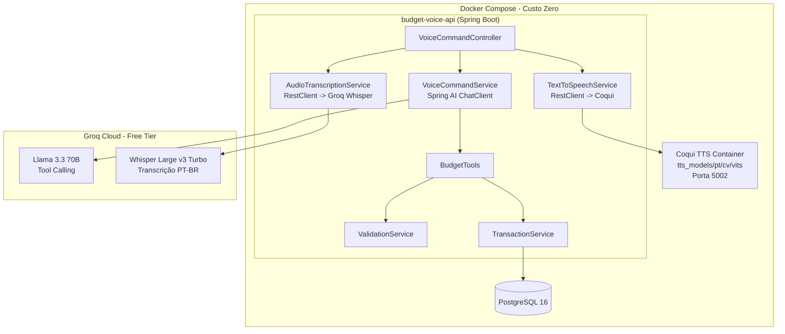

# Arquitetura

## Diagrama de Componentes

## Camadas

1. **Controller**: Recebe requisições HTTP, orquestra services e retorna respostas.
2. **Service**: Lógica de negócio e integração com IA.
3. **Tools**: Ferramentas chamadas pelo LLM via Tool Calling.
4. **Domain**: Entidades JPA e enums.
5. **Repository**: Acesso a dados via Spring Data JPA.

## Decisões Técnicas

### Por que AudioTranscriptionService usa RestClient diretamente?

O Spring AI possui auto-configure para módulos de áudio, mas optamos
por `RestClient` direto por duas razões:

1. **Maior controle**: A API Whisper do Groq retorna texto plano
   quando `response_format=text`, e o RestClient lida com isso de
   forma mais simples.
2. **Menos dependências**: Evita adicionar dependências específicas
   de áudio do Spring AI que poderiam conflitar ou exigir configuração
   adicional desnecessária.

### Por que Groq?

- **Custo zero**: Tier gratuito permanente sem cartão de crédito.
- **Compatibilidade OpenAI**: O Groq é compatível com a API da OpenAI,
  permitindo usar `spring-ai-openai-spring-boot-starter` apenas
  alterando `base-url` e `api-key` no `application.yml`.
- **Tool Calling**: Suporte completo a function calling, essencial
  para o fluxo de comandos de voz.
- **Whisper nativo**: Transcrição de áudio com o mesmo provedor.

### Por que Coqui TTS em Docker separado?

- **Isolamento**: O Coqui TTS roda em container independente, não
  afetando a inicialização da API.
- **Sem GPU**: O modelo CPU do Coqui funciona sem placa de vídeo.
- **Português**: Modelo `tts_models/pt/cv/vits` tem suporte nativo
  a português.
- **Cache de modelo**: O volume Docker `tts_models_cache` evita
  re-download do modelo a cada reinício.
