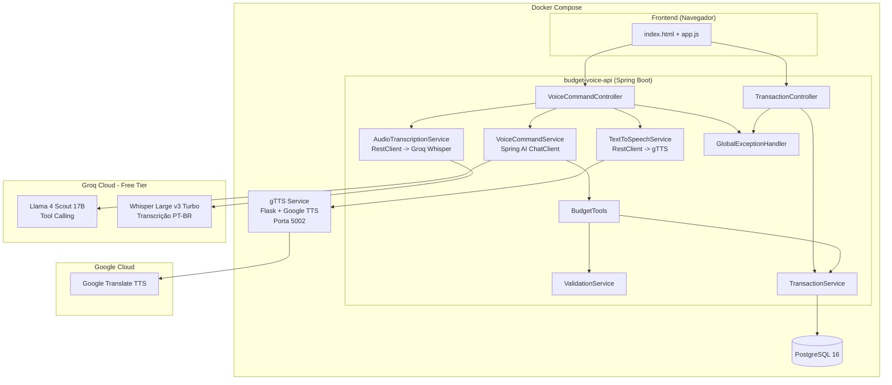
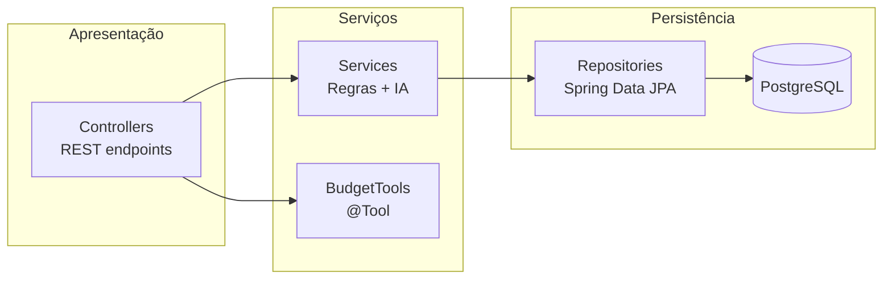
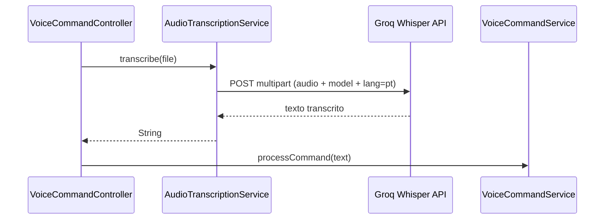

# Arquitetura

## Diagrama de Componentes

## Camadas

1. **Controller**: `VoiceCommandController` (`/api/voice/**`) e `TransactionController` (`/api/transactions/**`)
2. **Service**: Lógica de negócio (`TransactionService`, `ValidationService`) e integração com IA (`VoiceCommandService`, `AudioTranscriptionService`, `TextToSpeechService`)
3. **Tools**: Ferramentas anotadas com `@Tool` chamadas pelo LLM via Tool Calling
4. **Domain**: Entidades JPA, enums e DTOs
5. **Repository**: Acesso a dados via Spring Data JPA

## Decisões Técnicas

### Por que AudioTranscriptionService usa RestClient diretamente?

O Spring AI possui auto-configure para módulos de áudio, mas optamos por `RestClient` direto por:

1. **Maior controle**: A API Whisper do Groq retorna texto plano com `response_format=text`
2. **Menos dependências**: Evita dependências específicas de áudio do Spring AI

### Por que Groq?

- **Custo zero**: Tier gratuito permanente sem cartão de crédito
- **Compatibilidade OpenAI**: API compatível com OpenAI, permitindo usar `spring-ai-starter-model-openai` apenas alterando `base-url` e `api-key`
- **Tool Calling**: Suporte completo a function calling
- **Whisper nativo**: Transcrição de áudio com o mesmo provedor

### Por que gTTS em Docker separado?

- **Isolamento**: Serviço independente (Flask + gTTS), não afeta a API
- **Sem GPU**: Usa API do Google Translate, não exige hardware local
- **Português**: gTTS com `lang='pt-BR'` tem suporte nativo
- **Setup rápido**: Sem download de modelos, container inicia em segundos
- **Trade-off**: Requer internet para síntese; endpoint de texto (`/api/voice/command`) funciona offline
