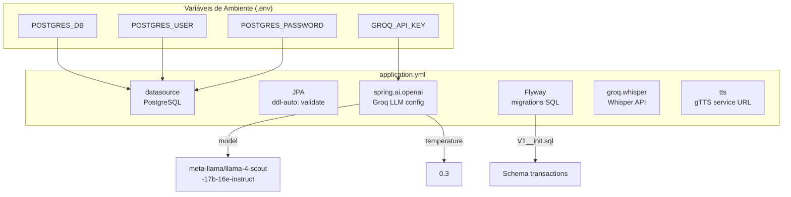
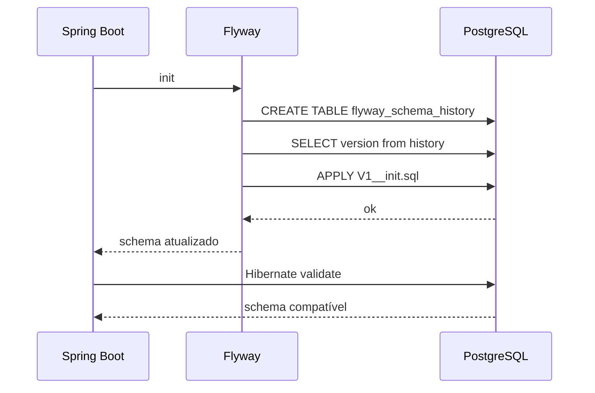
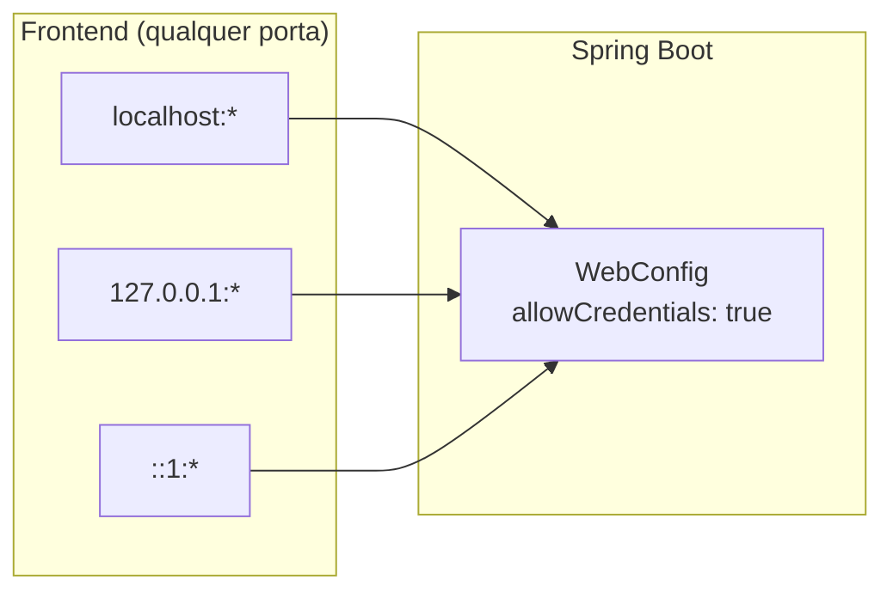

# Configuração

## Estrutura de Configuração

## Flyway e Migrations

### Por que `ddl-auto: validate` em vez de `update`?

```mermaid
graph LR
    subgraph Update["Hibernate ddl-auto: update"]
        U1[Cria/altera tabelas<br/>automaticamente]
        U2[Sem versionamento]
        U3[Perigoso em produção]
    end
    subgraph Validate["Hibernate ddl-auto: validate"]
        V1[Apenas verifica<br/>compatibilidade]
        V2[Flyway gerencia<br/>schema]
        V3[Seguro e<br/>reproduzível]
    end

    style Update fill:#291a1a,stroke:#f85149
    style Validate fill:#1a2d1a,stroke:#3fb950
```

O modo `update` cria/altera tabelas automaticamente com base nas entidades JPA, mas não versiona mudanças. Com `validate`, o Hibernate apenas verifica compatibilidade e o Flyway gerencia o schema.

### Por que Flyway?

Flyway aplica migrations SQL de forma ordenada e incremental. Cada migration é executada uma única vez, garantindo:

1. Schema reproduzível em qualquer ambiente
2. Alterações rastreadas no Git
3. Rollbacks com scripts manuais
4. Times diferentes com o mesmo schema

## Multipart Upload

O limite de 25MB corresponde ao limite máximo suportado pela API Whisper do Groq. O `max-request-size` de 26MB acomoda overhead do multipart form.

## Modelo LLM

O modelo configurado é `meta-llama/llama-4-scout-17b-16e-instruct` (Llama 4 Scout 17B). Para mudar, altere `spring.ai.openai.chat.options.model` no `application.yml`:

| Modelo | Característica |
|---|---|
| `meta-llama/llama-4-scout-17b-16e-instruct` | Padrão atual, multimodal, eficiente |
| `llama-3.3-70b-versatile` | Mais preciso, mais lento |
| `llama-3.1-8b-instant` | Mais rápido, menor qualidade |

## CORS

A configuração CORS em `WebConfig` permite origens `localhost` e `127.0.0.1` em qualquer porta. `allowCredentials(true)` é necessário se o frontend enviar cookies. Para produção, substitua `allowedOriginPatterns` por origens específicas.

## Propriedade `tts.coqui.url`

O nome da propriedade `tts.coqui.url` em `application.yml` é um resquício histórico. O serviço atualmente usa gTTS (não Coqui TTS). O valor aponta para `http://tts:5002` (container Docker) ou `http://localhost:5002` (desenvolvimento local).
