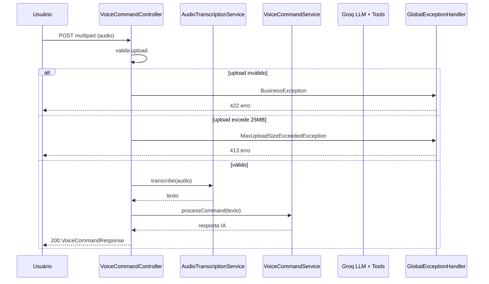

# Controller

## Visão Geral

```mermaid
graph LR
    subgraph Voice["/api/voice/**"]
        VC[VoiceCommandController]
        VC_POST1[POST /command]
        VC_POST2[POST /command/audio]
        VC_GET[GET /health]
    end
    subgraph Transactions["/api/transactions/**"]
        TC[TransactionController]
        TC_GET[GET /]
        TC_BAL[GET /balance]
        TC_SUM[GET /summary/{year}/{month}]
    end

    VC_POST1 --> VC
    VC_POST2 --> VC
    VC_GET --> VC
    TC_GET --> TC
    TC_BAL --> TC
    TC_SUM --> TC
```

## VoiceCommandController

### POST `/api/voice/command`

Processa comando de voz e retorna resposta em texto.



- **Request**: `multipart/form-data` com campo `audio`
- **Response 200**: `VoiceCommandResponse` (transcrição + resposta da IA)
- **Response 400**: Arquivo não enviado
- **Response 413**: Arquivo excede 25MB
- **Response 422**: Erro de negócio ou falha de transcrição

```bash
curl -X POST -F "audio=@comando.mp3" http://localhost:8080/api/voice/command
```

### POST `/api/voice/command/audio`

Processa comando de voz e retorna resposta em áudio WAV (requer gTTS operacional).

- **Request**: `multipart/form-data` com campo `audio`
- **Response 200**: `audio/wav` com a resposta sintetizada
- **Response 503**: Serviço TTS indisponível

```bash
curl -X POST -F "audio=@comando.mp3" http://localhost:8080/api/voice/command/audio --output resposta.wav
```

### GET `/api/voice/health`

Verifica se a API está rodando.

- **Response 200**: `Budget Voice API is running`

```bash
curl http://localhost:8080/api/voice/health
```

### Validação de Upload

Antes de processar, o controller valida:
- Arquivo não pode ser nulo ou vazio
- Tamanho máximo de 25MB
- Extensões permitidas: wav, mp3, m4a, ogg, flac, webm

## TransactionController

### GET `/api/transactions`

Lista transações com paginação.

- **Parâmetros**: `page` (default 0), `size` (default 20, max 100)
- **Response 200**: `Page<TransactionResponse>`

```bash
curl "http://localhost:8080/api/transactions?page=0&size=10"
```

### GET `/api/transactions/balance`

Retorna o saldo atual (entradas - saídas).

- **Response 200**: `{"balance": 1234.56}`

```bash
curl http://localhost:8080/api/transactions/balance
```

### GET `/api/transactions/summary/{year}/{month}`

Resumo financeiro de um mês específico com totais por categoria.

- **Response 200**: `MonthlySummaryResponse`

```bash
curl http://localhost:8080/api/transactions/summary/2026/6
```

## Tratamento de Erros

O `GlobalExceptionHandler` centraliza o tratamento:

| Exceção | Status | Body |
|---|---|---|
| `BusinessException` | 422 | `{"error": mensagem}` |
| `AudioProcessingException` | 422 | `{"error": mensagem}` |
| `ExternalServiceException` | 503 | `{"error": mensagem}` |
| `MethodArgumentNotValidException` | 400 | `[{campo: mensagem}]` |
| `MaxUploadSizeExceededException` | 413 | `{"error": "Arquivo excede o tamanho maximo de 25MB"}` |
| `Exception` (fallback) | 500 | `{"error": "Erro interno do servidor"}` |
