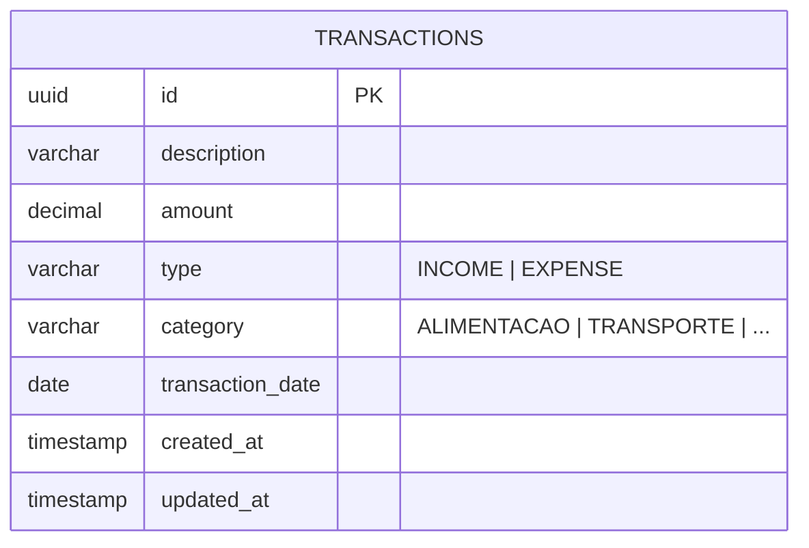
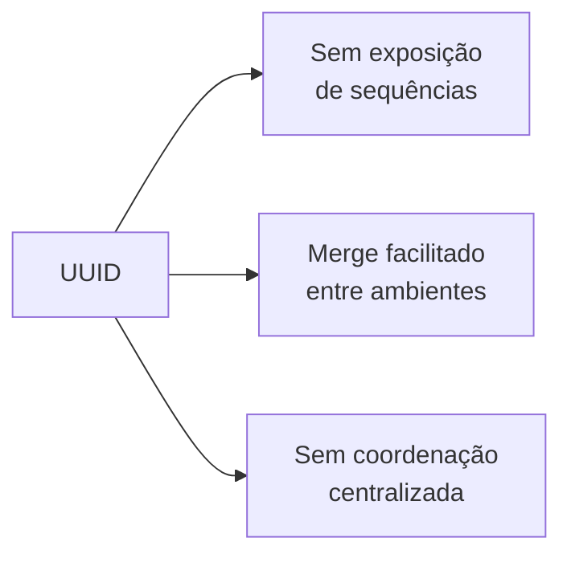

# Domínio

## Diagrama ER



## Relacionamento DTO / Entidade

```mermaid
graph LR
    subgraph Domain["Domínio"]
        T[Transaction<br/>@Entity JPA]
        TT[TransactionType<br/><<enum>>]
        TC[TransactionCategory<br/><<enum>>]
    end
    subgraph DTO["DTOs (Records)"]
        TR[TransactionResponse]
        MS[MonthlySummaryResponse]
        MS_CS[CategorySummary<br/>record interno]
        VC[VoiceCommandResponse]
    end
    subgraph Mapper["Mapeamento"]
        R[Repository<br/>Spring Data JPA]
        S[Service]
    end

    T --> TT
    T --> TC
    R --> T
    S --> R
    S --> TR
    S --> MS
    S --> VC
    MS --> MS_CS
```

## Entidades

### Transaction

Entidade JPA mapeada para a tabela `transactions`. Representa uma movimentação financeira (entrada ou saída). Usa UUID como chave primária.

### TransactionType

Enum com dois valores:
- `INCOME` — Entrada/receita
- `EXPENSE` — Saída/despesa

### TransactionCategory

Enum com 9 categorias para classificação:

| Categoria | Tipo | Exemplos |
|---|---|---|
| `ALIMENTACAO` | EXPENSE | mercado, restaurante, delivery |
| `TRANSPORTE` | EXPENSE | gasolina, uber, estacionamento |
| `MORADIA` | EXPENSE | aluguel, condomínio, água, luz |
| `SAUDE` | EXPENSE | médico, farmácia, plano de saúde |
| `LAZER` | EXPENSE | cinema, streaming, academia |
| `EDUCACAO` | EXPENSE | curso, faculdade, material |
| `OUTROS` | EXPENSE | despesas não listadas |
| `SALARIO` | INCOME | salário, holerite |
| `INVESTIMENTO` | INCOME | dividendos, rendimentos |

## DTOs

- **`TransactionResponse`**: expõe dados da transação sem acoplar à entidade JPA. Inclui `typeDescription` e `categoryDescription` para consumo pela API.
- **`MonthlySummaryResponse`**: resumo mensal com totais por categoria via record interno `CategorySummary`.
- **`VoiceCommandResponse`**: texto transcrito, resposta da IA e status.

## Por que UUID?



## Separação Entidade/DTO

Entidades JPA nunca são expostas diretamente nos endpoints. DTOs são records imutáveis que garantem controle sobre o que é retornado e desacoplam a API do schema interno.
