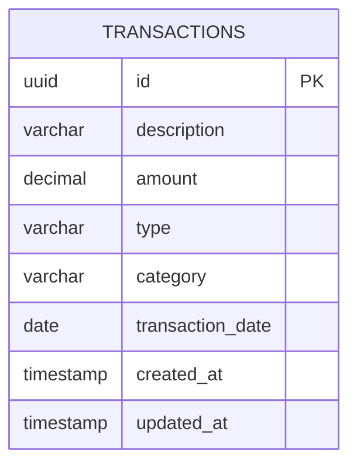

# Domínio

## Diagrama ER

## Entidades

### Transaction

Entidade JPA mapeada para a tabela `transactions`. Representa uma
movimentação financeira (entrada ou saída). Usa UUID como chave
primária para evitar exposição de sequências e facilitar escalabilidade.

### TransactionType

Enum com dois valores:
- `INCOME` - Entrada/receita
- `EXPENSE` - Saída/despesa

### TransactionCategory

Enum com 9 categorias para classificação das transações:
- ALIMENTACAO, TRANSPORTE, MORADIA, SAUDE, LAZER, EDUCACAO,
  SALARIO, INVESTIMENTO, OUTROS

## DTOs

### TransactionResponse

Record que expõe dados da transação sem acoplar à entidade JPA.
Inclui campos descritivos (`typeDescription`, `categoryDescription`)
para facilitar o consumo pela API.

### MonthlySummaryResponse

Record com resumo mensal incluindo totais por categoria via record
interno `CategorySummary`.

### VoiceCommandResponse

Record com o texto transcrito, resposta da IA e status da operação.

## Por que UUID?

- Evita exposição de IDs sequenciais
- Facilita merge de dados entre ambientes
- Não requer coordenação centralizada

## Separação Entidade/DTO

Entidades JPA nunca são expostas diretamente nos endpoints. DTOs
são records imutáveis que garantem controle sobre o que é retornado.
