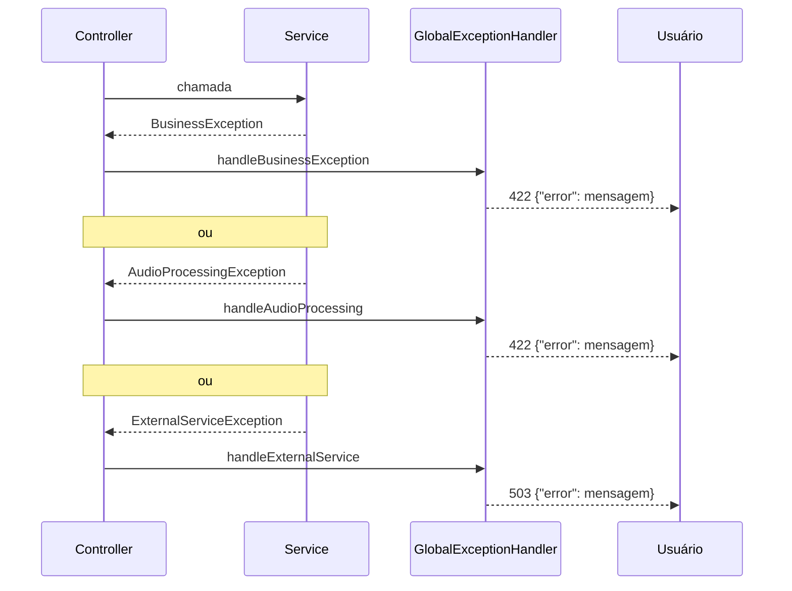

# Hierarquia de Exceções

## Estrutura

```mermaid
graph TD
    RTE[RuntimeException] --> BE[BusinessException]
    RTE --> APE[AudioProcessingException]
    RTE --> ESE[ExternalServiceException]

    BE -->|Validação| V[descrição, valor,<br/>tipo, categoria, data]
    APE -->|Transcrição| W[Groq Whisper]
    APE -->|Síntese| G[gTTS]
    ESE -->|Comunicação| GW[Groq API]
    ESE -->|Comunicação| GT[gTTS Service]
    ESE -->|Comunicação| O[outros externos]

    style BE fill:#1a1a2e,stroke:#e94560
    style APE fill:#1a1a2e,stroke:#e94560
    style ESE fill:#1a1a2e,stroke:#e94560
```



## Quando usar cada tipo

| Exceção | Cenário | HTTP |
|---|---|---|
| `BusinessException` | Validações de campos, valores inválidos | 422 |
| `AudioProcessingException` | Falha na transcrição (Whisper) ou síntese (gTTS) | 422 |
| `ExternalServiceException` | Falha de comunicação com Groq, gTTS ou serviços externos | 503 |

## Fluxo de Tratamento



## Por que não usar exceções genéricas?

Exceções genéricas (`RuntimeException`, `IllegalArgumentException`) não carregam semântica sobre a natureza do erro. O `GlobalExceptionHandler` precisa do tipo da exceção para determinar o status HTTP correto.

Com exceções específicas, o tratamento é declarativo e sem `instanceof`:

```java
@ExceptionHandler(BusinessException.class)
@ResponseStatus(HttpStatus.UNPROCESSABLE_ENTITY)
public ErrorResponse handle(BusinessException ex) {
    return new ErrorResponse(ex.getMessage());
}
```
