# Como Testar

## Inicialização

```bash
cp .env.example .env
# Edite .env e insira GROQ_API_KEY=gsk_sua_chave
docker compose up --build
```

### Ordem de Inicialização

```mermaid
graph LR
    PG[(PostgreSQL)] -->|healthcheck passou| API[Spring Boot]
    GTTS[gTTS Flask] -->|healthcheck passou| API
    API -->|pronto| END[localhost:8080]

    style PG fill:#2d4a22,stroke:#3fb950
    style GTTS fill:#2d4a22,stroke:#3fb950
    style API fill:#1a1a2e,stroke:#58a6ff
    style END fill:#291a1a,stroke:#f85149
```



1. PostgreSQL (healthcheck em segundos)
2. gTTS (Flask, segundos — sem download de modelo)
3. API Spring Boot (assim que PostgreSQL e gTTS estiverem prontos)

## Testando a API

### Health Check
```bash
curl http://localhost:8080/api/voice/health
# Resposta: Budget Voice API is running
```

### Enviar comando de voz
```bash
curl -X POST -F "audio=@meuaudio.mp3" http://localhost:8080/api/voice/command
```

### Consultar transações
```bash
curl http://localhost:8080/api/transactions
```

### Consultar saldo
```bash
curl http://localhost:8080/api/transactions/balance
```

### Resumo do mês
```bash
curl http://localhost:8080/api/transactions/summary/2026/6
```

### Resposta em áudio
```bash
curl -X POST -F "audio=@meuaudio.mp3" http://localhost:8080/api/voice/command/audio --output resposta.wav
```

## Exemplos de Comandos de Voz

- "Gastei cinquenta reais em almoço hoje"
- "Recebi meu salário de cinco mil reais"
- "Qual é meu saldo atual?"
- "Como foram meus gastos esse mês?"
- "Mostre meus gastos dos últimos 7 dias"
- "Quanto gastei em cada categoria?"

## Observações

- O endpoint de áudio requer conexão com internet para sintetizar voz via Google TTS
- A API responde em texto imediatamente, independentemente do TTS
- Acesse o frontend em `http://localhost:8080` para interface visual
