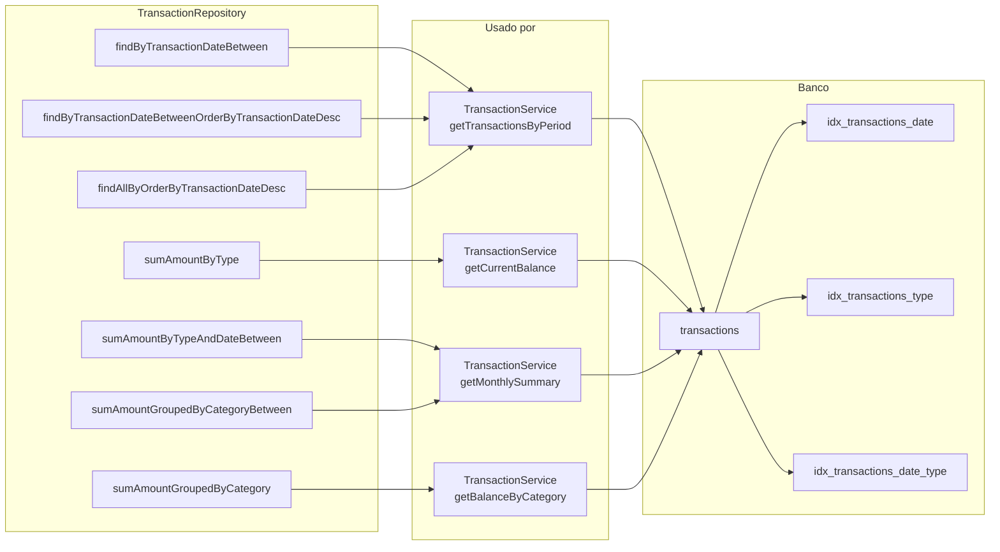

# Repository

## Queries Implementadas

### `findByTransactionDateBetween`
Busca transações por período. Usada por serviços que precisam filtrar por intervalo de datas.

### `findByTransactionDateBetweenOrderByTransactionDateDesc`
Mesmo filtro com ordenação descendente. Evita ordenação em memória.

### `sumAmountByTypeAndDateBetween`
Soma de valores por tipo e período via JPQL. Usa `SUM` nativo do banco para agregação eficiente.

### `sumAmountByType`
Soma total de um tipo (INCOME ou EXPENSE) sem filtro de data.

### `findAllByOrderByTransactionDateDesc` (paginada)
Lista paginada ordenada por data. Evita carregar todas as transações.

### `sumAmountGroupedByCategory`
Agrupa saldo por categoria usando `CASE WHEN` no SQL.

### `sumAmountGroupedByCategoryBetween`
Mesmo agrupamento com filtro de período. Usada pelo relatório mensal.

## Por que JPQL em vez de Java?

```mermaid
graph LR
    subgraph Antes["Antes (em memória)"]
        A1[findAll]
        A2[Stream.filter]
        A3[Stream.collect]
    end
    subgraph Depois["Depois (JPQL)"]
        B1[SUM + GROUP BY]
        B2[Resultado agregado]
    end

    A1 --> A2 --> A3
    B1 --> B2

    style Antes fill:#291a1a,stroke:#f85149
    style Depois fill:#1a2d1a,stroke:#3fb950
```

As queries agregadas transferem o processamento para o banco de dados, que é otimizado para isso. A abordagem anterior carregava todas as transações em memória e fazia agrupamento com Streams.

## Índices

| Índice | Colunas | Query beneficiada |
|---|---|---|
| `idx_transactions_date` | `transaction_date` | Relatório mensal, listagem por data |
| `idx_transactions_type` | `type` | Saldo agregado por tipo |
| `idx_transactions_date_type` | `transaction_date, type` | `sumAmountByTypeAndDateBetween` |
