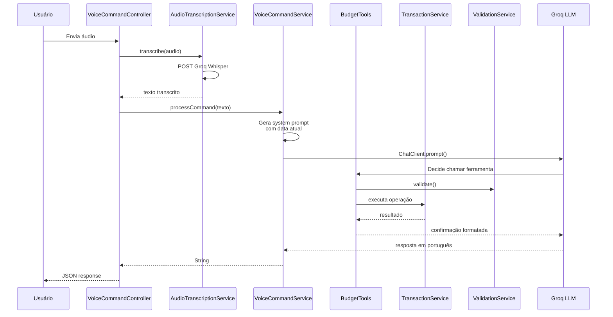

# Services

## Fluxo de Chamadas

## VoiceCommandService

Usa o Spring AI `ChatClient` para enviar o texto transcrito ao LLM (Groq Llama 4 Scout via API compatível OpenAI). O `ChatClient` é configurado por request com um system prompt dinâmico (gerado por `AiConfig.buildSystemPrompt()`) e tem acesso às ferramentas `BudgetTools`.

Trata retorno nulo do LLM com fallback para mensagem padrão.

## AudioTranscriptionService

Usa `RestClient` para chamar diretamente a API Whisper do Groq. A chamada é um POST multipart/form-data para `https://api.groq.com/openai/v1/audio/transcriptions` com o arquivo de áudio, modelo, idioma "pt" e `response_format=text`.

**Timeouts:**
- connectTimeout: 10s (conexão com Groq)
- readTimeout: 60s (áudios longos)

Lança `AudioProcessingException` em caso de falha.

## TextToSpeechService

Usa `RestClient` para chamar o serviço gTTS rodando em Docker no container `budget_tts`. A requisição é um GET para `/api/tts?text=...` e o retorno são bytes WAV.

**Timeouts:**
- connectTimeout: 5s (rede local Docker)
- readTimeout: 30s (textos longos)

Lança `ExternalServiceException` em caso de falha (HTTP 503).

## ValidationService

Serviço com responsabilidade única de validar dados antes da persistência. Valida descrição, valor, tipo, categoria e data. Lança `BusinessException` para qualquer violação.

## TransactionService

Service de negócio que gerencia transações financeiras. Depende de `TransactionRepository` para persistência e `ValidationService` para validação.

**Métodos:**
- `createTransaction`: registra movimentação
- `getCurrentBalance`: saldo atual (entradas - saídas)
- `getTransactionsByPeriod`: histórico por período
- `getMonthlySummary`: resumo mensal com agregados
- `getBalanceByCategory`: saldo por categoria

## Acoplamento Fraco

```mermaid
graph LR
    ATS[AudioTranscriptionService] -->|RestClient| GroqW[Groq Whisper]
    VCS[VoiceCommandService] -->|ChatClient + Tools| LLM[Groq LLM]
    VCS --> BT[BudgetTools]
    TTS[TextToSpeechService] -->|RestClient| GTTSS[gTTS Service]
    TS[TransactionService] --> VS[ValidationService]
    TS -->|Spring Data| R[Repository]

    style ATS fill:#1a1a2e,stroke:#e94560
    style VCS fill:#1a1a2e,stroke:#e94560
    style TTS fill:#1a1a2e,stroke:#e94560
    style TS fill:#16213e,stroke:#0f3460
    style VS fill:#16213e,stroke:#0f3460
```

Nenhum dos três services de IA conhece os outros — são orquestrados pelo Controller.
