# Testes

## Pirâmide de Testes

```mermaid
graph TB
    subgraph Web["Web (@WebMvcTest)"]
        W1[VoiceCommandControllerTest]
        W2[valida upload]
        W3[códigos de erro]
        W4[health check]
    end
    subgraph Unit["Unitários (Mockito)"]
        U1[ValidationServiceTest]
        U2[TransactionServiceTest]
        U3[AiConfigTest]
    end

    U1 -->|depende de| U2
    U2 -->|valida fluxo| W1
    U3 -->|valida prompt| U1

    style Web fill:#1a1a2e,stroke:#58a6ff
    style Unit fill:#1a2d1a,stroke:#3fb950
```



## Estratégia

### Unitários (Mockito)
| Teste | O que verifica |
|---|---|
| `ValidationServiceTest` | Todas as regras de validação (descrição, valor, tipo, categoria, data), fallback para categoria inválida |
| `TransactionServiceTest` | Fluxo completo de criação, cálculo de saldo, geração de resumo mensal com repositório mockado |
| `AiConfigTest` | `buildSystemPrompt()` gera data atual, mês, ontem; não contém datas hardcodadas |

### Web (MockMvc)
| Teste | O que verifica |
|---|---|
| `VoiceCommandControllerTest` | Validação de upload (arquivo ausente, tamanho excessivo), health check, serviços mockados |

## O que é testado em cada camada

```mermaid
graph LR
    subgraph Validation["ValidationService"]
        V1[descrição<br/>não vazia]
        V2[valor<br/>positivo]
        V3[tipo<br/>válido]
        V4[categoria<br/>válida]
        V5[data<br/>válida]
    end
    subgraph Transaction["TransactionService"]
        T1[criação<br/>completa]
        T2[saldo<br/>atual]
        T3[resumo<br/>mensal]
    end
    subgraph AI["AiConfig"]
        A1[data<br/>dinâmica]
        A2[ontem<br/>presente]
        A3[sem ano<br/>hardcodado]
    end
    subgraph Controller["VoiceCommandController"]
        C1[upload<br/>válido]
        C2[arquivo<br/>grande]
        C3[health<br/>check]
    end

    style Validation fill:#1a1a2e,stroke:#bc8cff
    style Transaction fill:#1a1a2e,stroke:#bc8cff
    style AI fill:#1a1a2e,stroke:#bc8cff
    style Controller fill:#1a1a2e,stroke:#58a6ff
```



## Por que esta abordagem?

Testes unitários são rápidos e não exigem infraestrutura (banco, Docker). Testes `@WebMvcTest` validam a camada web sem iniciar o contexto completo do Spring. A combinação cobre a maior parte dos cenários de erro sem depender de serviços externos (Groq, Whisper, gTTS).

### Como executar

```bash
# Todos os testes
./mvnw test

# Apenas AiConfigTest
./mvnw test -Dtest=AiConfigTest

# Apenas testes de service
./mvnw test -Dtest="*ServiceTest"
```
