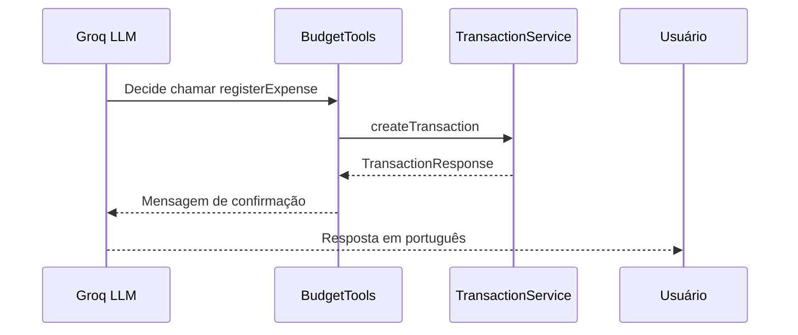

# Tools (Tool Calling)

## Padrão

O Spring AI com Groq implementa o padrão Tool Calling (function calling).
Quando o usuário envia um comando de voz, o LLM analisa o texto e decide
qual ferramenta (método anotado com `@Tool`) deve ser chamada com base
na descrição da ferramenta e dos parâmetros.

## Ferramentas

### registerExpense
- **Descrição**: Registra uma nova despesa
- **Parâmetros**: description, amount, category, date
- **Retorno**: Mensagem de confirmação com valor formatado

### registerIncome
- **Descrição**: Registra uma nova entrada
- **Parâmetros**: description, amount, category, date
- **Retorno**: Mensagem de confirmação com valor formatado

### getCurrentBalance
- **Descrição**: Retorna saldo atual (entradas - saídas)
- **Parâmetros**: Nenhum
- **Retorno**: Saldo formatado em reais

### listRecentTransactions
- **Descrição**: Lista transações dos últimos N dias
- **Parâmetros**: days (número de dias)
- **Retorno**: Lista formatada com até 20 transações

### getMonthlySummary
- **Descrição**: Resumo financeiro de um mês específico
- **Parâmetros**: month (1-12), year (ex: 2025)
- **Retorno**: Resumo com totais e breakdown por categoria

### getBalanceByCategory
- **Descrição**: Saldo agrupado por categoria
- **Parâmetros**: Nenhum
- **Retorno**: Lista de categorias com saldos

## Por que descrições em inglês?

O LLM Llama 3.3 70B foi treinado predominantemente com dados em
inglês e processa descrições técnicas com mais precisão nesse idioma.
As respostas ao usuário são sempre em português.
