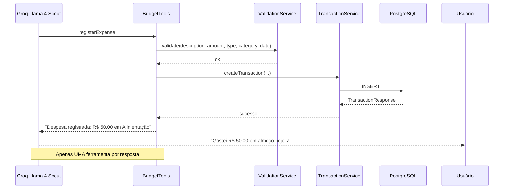

# Tools (Tool Calling)

## Padrão

O Spring AI com Groq implementa Tool Calling (function calling). Quando o usuário envia um comando de voz, o LLM analisa o texto e decide qual ferramenta chamar com base na descrição da ferramenta e dos parâmetros.

## Diagrama de Sequência

## Ferramentas Disponíveis

| Ferramenta | Descrição | Parâmetros | Quando usar |
|---|---|---|---|
| `registerExpense` | Registra despesa | description, amount, category, date | "gastei", "comprei", "paguei" |
| `registerIncome` | Registra entrada | description, amount, category, date | "recebi", "salário" |
| `getCurrentBalance` | Saldo total | nenhum | "qual meu saldo?" |
| `listRecentTransactions` | Últimas transações | days | "últimos 7 dias" |
| `getMonthlySummary` | Resumo mensal | month, year | "como foi esse mês?" |
| `getBalanceByCategory` | Saldo por categoria | nenhum | "quanto gastei em cada?" |

### Detalhamento

#### registerExpense
- **Descrição**: Registra uma nova despesa
- **Parâmetros**: `description` (texto), `amount` (valor), `category` (ALIMENTACAO, TRANSPORTE, MORADIA, SAUDE, LAZER, EDUCACAO, OUTROS), `date` (yyyy-MM-dd, opcional)
- **Validação**: Descrição não vazia, valor positivo, categoria válida para EXPENSE

#### registerIncome
- **Descrição**: Registra uma nova entrada
- **Parâmetros**: `description` (texto), `amount` (valor), `category` (SALARIO, INVESTIMENTO, OUTROS), `date` (yyyy-MM-dd, opcional)
- **Validação**: Descrição não vazia, valor positivo, categoria válida para INCOME

#### getCurrentBalance
- **Descrição**: Retorna saldo atual (entradas - saídas)
- **Parâmetros**: Nenhum
- **Retorno**: Saldo formatado em reais

#### listRecentTransactions
- **Descrição**: Lista transações dos últimos N dias
- **Parâmetros**: `days` (número de dias, default 30)
- **Retorno**: Lista formatada com até 20 transações

#### getMonthlySummary
- **Descrição**: Resumo financeiro de um mês específico
- **Parâmetros**: `month` (1-12), `year` (ex: 2026)
- **Retorno**: Resumo com totais e breakdown por categoria

#### getBalanceByCategory
- **Descrição**: Saldo agrupado por categoria
- **Parâmetros**: Nenhum
- **Retorno**: Lista de categorias com saldos

## Anti-Alucinação

O system prompt orienta o LLM a:
- Nunca inventar números — usar sempre dados reais das ferramentas
- Confirmar ações com valores exatos retornados
- Perguntar ao usuário se não souber um valor
- Não confirmar registro sem sucesso da ferramenta
- Informar transações duplicadas rejeitadas pelo sistema

## Por que descrições em inglês?

O LLM Llama 4 Scout 17B foi treinado predominantemente com dados em inglês e processa descrições técnicas com mais precisão nesse idioma. As respostas ao usuário são sempre em português.
