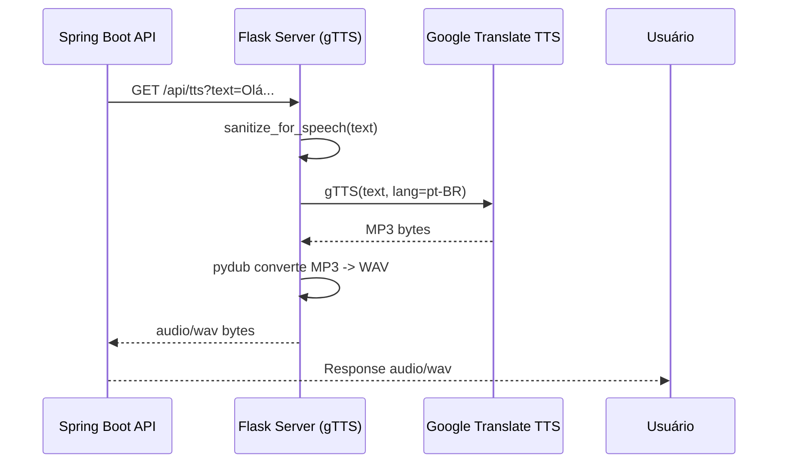

# Serviço de Síntese de Voz (TTS)

## Fluxo

## Implementação

O serviço TTS é um servidor Flask Python que usa a biblioteca `gTTS` (Google Text-to-Speech) para sintetizar voz em português brasileiro.

### Pipeline de Processamento

```mermaid
graph LR
    T[Texto LLM<br/>com markdown] -->|sanitize_for_speech| C[Texto limpo<br/>sem markdown]
    C -->|gTTS| M[MP3]
    M -->|pydub + ffmpeg| W[WAV 16-bit]
    W -->|Response| U[Usuário]

    style T fill:#1a1a2e,stroke:#e94560
    style C fill:#1a2d1a,stroke:#3fb950
    style W fill:#1a1a2e,stroke:#58a6ff
```

## sanitize_for_speech

Remove artefatos de markdown e formatos técnicos que seriam lidos literalmente pelo TTS:

| Padrão | Substituição |
|---|---|
| `http://...` (URLs) | removido |
| `* _ # ~ `` ` (markdown) | removido |
| `[texto](url)` (links) | apenas o texto |
| `\|` (tabelas) | `, ` |
| `- * +` (bullets) | removido |
| `\n{2,}` (quebras) | `. ` |

## Endpoints

- **`GET /health`** — Retorna 200 ok (usado pelo Docker healthcheck)
- **`GET /api/tts?text={texto}`** — Retorna `audio/wav` com o texto sintetizado

## Trade-offs

| Aspecto | gTTS |
|---|---|
| Qualidade | Alta (Google TTS neural) |
| Custo | Gratuito (limites de uso) |
| Latência | ~1-3s (depende de rede) |
| Offline | Não funciona |
| Setup | Instantâneo (sem download) |
| Idioma | PT-BR nativo |

## Por que não Coqui TTS?

```mermaid
graph LR
    subgraph Coqui["Coqui TTS (descartado)"]
        C1[Download: 2-5 min<br/>no primeiro uso]
        C2[Qualidade inferior<br/>modelo CPU]
        C3[Volume Docker<br/>tts_models_cache]
    end
    subgraph gTTS["gTTS (atual)"]
        G1[Setup: segundos<br/>sem download]
        G2[Qualidade superior<br/>Google neural]
        G3[Dependência de<br/>internet]
    end

    style Coqui fill:#291a1a,stroke:#f85149
    style gTTS fill:#1a2d1a,stroke:#3fb950
```

Coqui TTS foi considerado inicialmente por ser auto-hospedado (sem dependência de rede externa). No entanto, o modelo CPU para português (`tts_models/pt/cv/vits`) exige 2-5 minutos de download no primeiro uso e tem qualidade inferior. O gTTS oferece melhor qualidade com setup mais simples para um projeto de estudo.
