# FormatUtils

## Propósito

Classe utilitária que centraliza formatadores usados em múltiplos serviços da aplicação. Evita duplicação de constantes e garante consistência na formatação de datas e valores monetários.

## Quem usa FormatUtils

```mermaid
graph TB
    FU[FormatUtils<br/>classe utilitária] -->|DATE_STORAGE| BT[BudgetTools<br/>parse de data]
    FU -->|DATE_DISPLAY| BT
    FU -->|brazilianCurrency| BT
    FU -->|DATE_STORAGE| VS[ValidationService<br/>validação de data]
    FU -->|brazilianCurrency| R[Relatórios<br/>do LLM]

    style FU fill:#1a1a2e,stroke:#bc8cff
    style BT fill:#1a2d1a,stroke:#3fb950
    style VS fill:#1a2d1a,stroke:#3fb950
    style R fill:#1a2d1a,stroke:#3fb950
```

## Constantes e Métodos

| Nome | Tipo | Padrão | Uso |
|---|---|---|---|
| `DATE_STORAGE` | `DateTimeFormatter` | `yyyy-MM-dd` | Persistência e parsing |
| `DATE_DISPLAY` | `DateTimeFormatter` | `dd/MM/yyyy` | Exibição em respostas |
| `brazilianCurrency()` | `NumberFormat` | `pt_BR` (R$) | Formatação monetária |

### Thread-safety

`brazilianCurrency()` é um método (não constante) que retorna uma nova instância de `NumberFormat` a cada chamada. Isso é necessário porque `NumberFormat` não é thread-safe.

## Por que centralizar?

```mermaid
graph LR
    subgraph Antes["Antes (duplicado)"]
        A1[ValidationService<br/>DateTimeFormatter próprio]
        A2[BudgetTools<br/>DateTimeFormatter próprio]
        A3[Outros<br/>cada um o seu]
    end
    subgraph Depois["Depois (centralizado)"]
        B1[FormatUtils<br/>fonte única]
        B2[Todos usam<br/>a mesma referência]
    end

    A1 -.->|inconsistente| A2
    A2 -.->|inconsistente| A3
    B1 --> B2

    style Antes fill:#291a1a,stroke:#f85149
    style Depois fill:#1a2d1a,stroke:#3fb950
```

Antes da centralização, `ValidationService` e `BudgetTools` definiam seus próprios `DateTimeFormatter` com o mesmo padrão. A centralização garante que qualquer alteração de formato seja refletida em todos os pontos de uso sem necessidade de buscar referências duplicadas.
